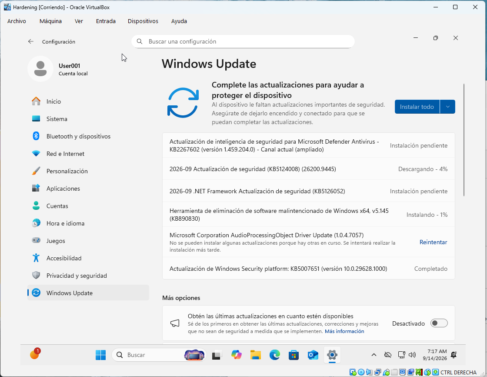
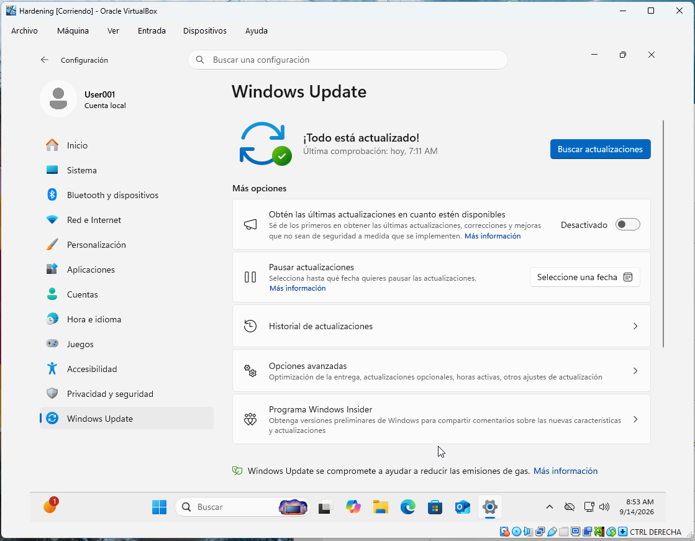
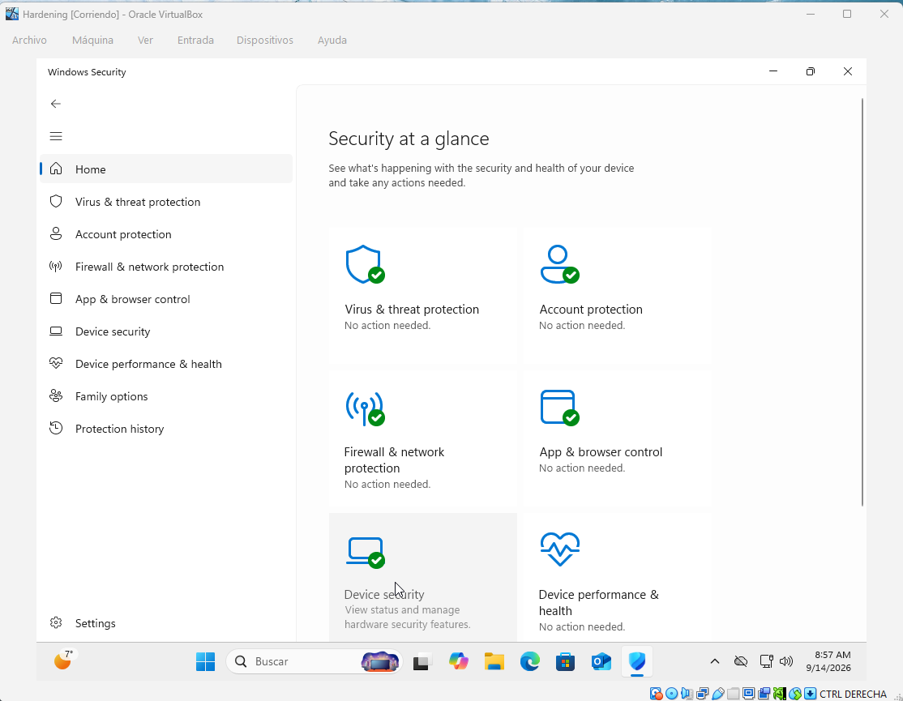
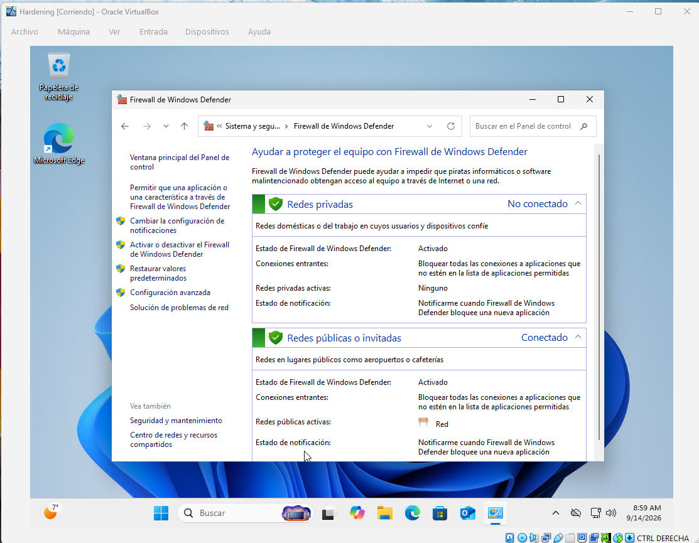
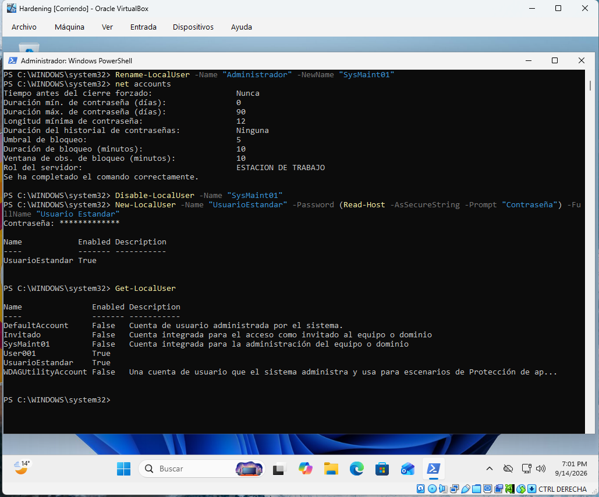
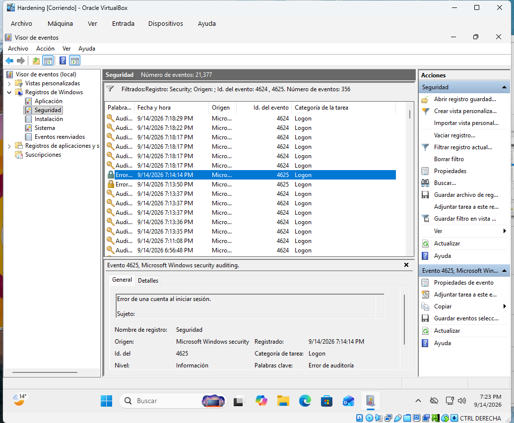
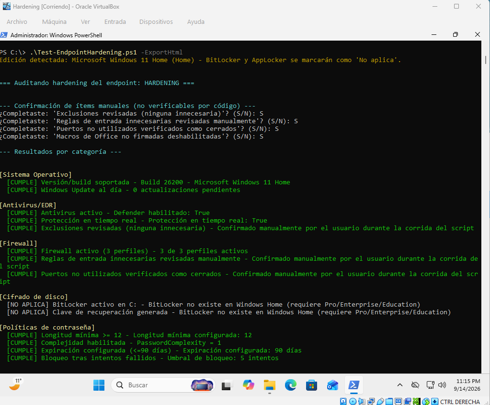
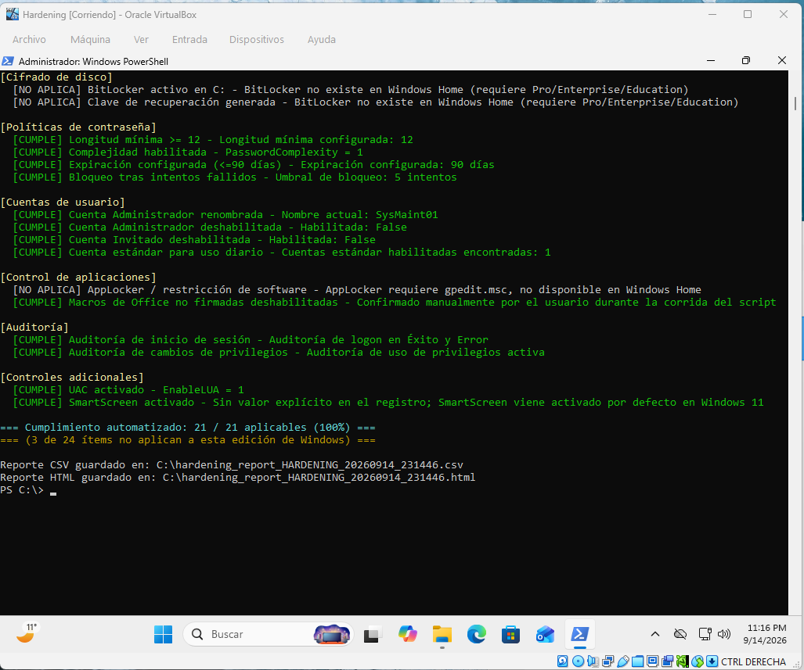

# 🔒 Hardening de un Endpoint — Nueva PC Windows

Proyecto de documentación completa del proceso de asegurar una PC Windows nueva desde cero, como preparación de un equipo para un empleado. Incluye evidencia paso a paso (capturas), una checklist reutilizable y un script de PowerShell que audita automáticamente el cumplimiento.

## Objetivo

Demostrar el proceso end-to-end de bastionado (*hardening*) de un endpoint corporativo: actualización, protección activa, control de red, cifrado, control de acceso, control de ejecución y auditoría — cerrando con una herramienta que verifica el cumplimiento de forma automatizada.

## Entorno de prueba

- **Host:** VirtualBox 7.x
- **Sistema operativo:** Windows 11 Home (64-bit)
- **Nota sobre la edición:** algunos controles de esta checklist (BitLocker, AppLocker) requieren Windows Pro/Enterprise/Education y no están disponibles en Home. Se documentan igual más abajo, explicando cómo se implementarían, y el script de auditoría los marca automáticamente como **"No aplica"** en vez de penalizarlos como incumplimiento.

## Resumen de resultados

| # | Control | Estado en esta ejecución | Método usado |
|---|---|---|---|
| 1 | Sistema operativo actualizado | ✅ Cumple | Windows Update |
| 2 | Antivirus / EDR | ✅ Cumple | Windows Defender |
| 3 | Firewall | ✅ Cumple | Firewall de Windows |
| 4 | Cifrado de disco (BitLocker) | 🏠 No aplica (Home) | — |
| 5 | Políticas de contraseña | ✅ Cumple | `net accounts` (CLI) |
| 6 | Cuentas de usuario | ✅ Cumple | PowerShell (`Rename-LocalUser`, `Disable-LocalUser`, `New-LocalUser`) |
| 7 | Control de aplicaciones (AppLocker) | 🏠 No aplica (Home) | — |
| 8 | Auditoría | ✅ Cumple | `auditpol` (CLI) |
| 9 | Checklist + script de verificación | ✅ Completo | Ver `checklist-seguridad-nueva-pc.md` y `Test-EndpointHardening.ps1` |

---

## Paso 1 — Sistema operativo actualizado

Se ejecutó Windows Update hasta dejar el sistema sin actualizaciones pendientes, y se verificó la versión/build final con `winver`.




## Paso 2 — Antivirus / EDR

Se confirmó que Windows Defender está activo, con protección en tiempo real habilitada.



## Paso 3 — Firewall

Se verificó que el firewall de Windows está activo en los 3 perfiles (Dominio, Privado, Público) y se revisaron las reglas de entrada.



## Paso 4 — Cifrado de disco (BitLocker) 🏠

> **No aplicable en esta ejecución** — Windows 11 Home no incluye BitLocker (requiere Pro, Enterprise o Education). Se documenta el procedimiento para un entorno donde sí esté disponible:

1. Panel de Control > Sistema y seguridad > Cifrado de unidad BitLocker > "Activar BitLocker" en la unidad C:
2. Elegir cómo guardar la clave de recuperación — **nunca en la misma unidad que se cifra**. Este es el detalle que más se pasa por alto en el trabajo de campo: sin la clave respaldada externamente, un fallo de hardware significa pérdida total de datos.
3. Elegir el alcance del cifrado (solo espacio usado vs. disco completo) y el modo de cifrado.
4. Confirmar y reiniciar; el cifrado corre en segundo plano.
5. Verificar el estado final: "BitLocker activado" en el panel.

*(En un entorno Pro/Enterprise, esta sección llevaría las capturas del proceso completo y de la clave de recuperación, con los números tapados por seguridad.)*

## Paso 5 — Políticas de contraseña local

En Windows Home, `secpol.msc` no está disponible. Se configuró vía línea de comandos con `net accounts`: longitud mínima de 12 caracteres, expiración a los 90 días y bloqueo tras 5 intentos fallidos.

```powershell
net accounts /minpwlen:12 /maxpwage:90 /lockoutthreshold:5
```

> Nota: la complejidad de contraseña (`PasswordComplexity`) no es configurable por comando en Home; requiere Pro/Enterprise con GPO o `secedit`.

## Paso 6 — Cuentas de usuario

Se renombró y deshabilitó la cuenta "Administrador" local, y se creó una cuenta estándar para uso diario — todo vía PowerShell, ya que `lusrmgr.msc` tampoco está disponible en Home.

```powershell
Rename-LocalUser -Name "Administrator" -NewName "SysMaint01"
Disable-LocalUser -Name "SysMaint01"
New-LocalUser -Name "UsuarioEstandar" -Password (Read-Host -AsSecureString) -FullName "Usuario Estandar"
```



## Paso 7 — Control de aplicaciones (AppLocker) 🏠

> **No aplicable en esta ejecución** — AppLocker se administra vía `gpedit.msc`, no disponible en Windows Home. Se documenta el procedimiento para un entorno donde sí esté disponible:

1. `gpedit.msc` > Configuración del equipo > Configuración de Windows > Configuración de seguridad > Directivas de control de aplicaciones > AppLocker.
2. Clic derecho en "Reglas ejecutables" > "Crear reglas predeterminadas" (permite lo instalado en Archivos de programa/Windows, bloquea el resto).
3. Repetir para "Reglas de instalador de Windows" y "Reglas de script".
4. Activar el servicio "Application Identity" (requerido para que las reglas se apliquen, no solo se creen).

**Macros de Office** (parte del mismo control, no depende de la edición de Windows): en Word/Excel > Opciones > Centro de confianza > Configuración de macros > "Deshabilitar todas las macros excepto las firmadas digitalmente".

*(En un entorno Enterprise/Education, esta sección llevaría las capturas de las reglas de AppLocker creadas por categoría.)*

## Paso 8 — Auditoría

Se activó auditoría de inicio de sesión y de uso de privilegios vía `auditpol` (alternativa por línea de comandos a `secpol.msc`, no disponible en Home). Se generó un evento de prueba forzando un login fallido y se verificó en el Visor de eventos.

```powershell
auditpol /set /subcategory:"Inicio de sesión" /success:enable /failure:enable
auditpol /set /subcategory:"Uso de privilegios confidenciales" /success:enable /failure:enable
```



## Paso 9 — Checklist y herramienta de verificación automatizada

Como valor agregado del proyecto, se armó:

- **[`checklist-seguridad-nueva-pc.md`](Checklist-Seguridad-Nueva-PC.md)** — checklist de 20 ítems reutilizable para cualquier PC nueva.
- **[Checklist interactiva](https://valenbertu.github.io/Hardening-Endpoint/)** - Nueva CheckList interactiva hosteada en github
- **[`Test-EndpointHardening.ps1`](Test-EndpointHardening.ps1)** — script de PowerShell que audita 16 de esos 20 ítems automáticamente, detecta la edición de Windows (marcando BitLocker/AppLocker como "No aplica" en Home en vez de "No cumple"), y genera un reporte de cumplimiento en consola, CSV y HTML.

### Cómo correrlo

```powershell
# Como Administrador, en la carpeta del script:
Set-ExecutionPolicy -Scope Process -ExecutionPolicy Bypass
.\Test-EndpointHardening.ps1 -ExportHtml
```

### Reporte de cumplimiento final




---

## Herramientas usadas

- VirtualBox 7 (con TPM 2.0 y Secure Boot habilitados)
- Windows 11 Home
- PowerShell 5.1
- Visor de eventos, `secedit`, `auditpol`, `net accounts`

## Autor
Valentin Bertuccelli / www.linkedin.com/in/valentin-bertuccelli-139847291
